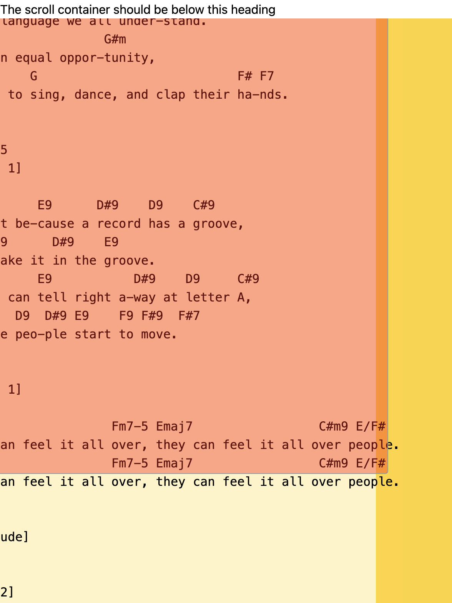

# Overflow auto

The text of the `<pre>` overflows horizontally and verically. You see that only the text overflows, not the background color (amber-100), but that is not a problem because I can set it on the container (amber-300) .

The same happens with the ReactSketchCancas. You see that #ff000066 orange background color does not overflow, including the canvas itself.

Can we make the canvas as large as the overflowed contents, so that we can sketch even when we have scrolled to the right and to the bottom?

